<div align="center">


# ⛏️ VoxelCraft

### Punch a tree. Build a house. Slay a dragon.<br>All in a block game written from scratch in Rust.

<p>
  <a href="https://github.com/BrendanH18/VoxelCraft/actions/workflows/ci.yml"></a>
  <a href="https://github.com/BrendanH18/VoxelCraft/releases"></a>
  <a href="Cargo.toml"></a>
  <a href="https://wgpu.rs"></a>
  <a href="#license"></a>
</p>

<p>
  <a href="https://github.com/BrendanH18/VoxelCraft/releases"><strong>⬇️ Download</strong></a> &nbsp;·&nbsp;
  <a href="#tour">Tour</a> &nbsp;·&nbsp;
  <a href="#first-night">First night</a> &nbsp;·&nbsp;
  <a href="docs/gameplay.md">Gameplay guide</a> &nbsp;·&nbsp;
  <a href="#multiplayer">Multiplayer</a> &nbsp;·&nbsp;
  <a href="#under-the-hood">Under the hood</a> &nbsp;·&nbsp;
  <a href="CONTRIBUTING.md">Contribute</a>
</p>

</div>

---

VoxelCraft is a love letter to the classic block game, rebuilt one system at
a time. Every texture is painted by code, every sound and song is
synthesized as you play, and there isn't a single bundled game asset in the
repository.

It's still early, but it's already a real game: you can start in a field with
nothing, work your way up to diamond, light a portal to the Nether, track down
a stronghold, and watch the credits roll after the Ender Dragon falls.

> [!TIP]
> **Just want to play?** Grab the Windows or Mac installer from
> [Releases](https://github.com/BrendanH18/VoxelCraft/releases). Prefer to
> build it yourself? Jump to [Build from source](#build-from-source).

<a id="tour"></a>

## 🗺️ A quick tour

<table>
  <tr>
    <td width="50%" valign="top">
      <br>
      <h3>🌍 An endless world</h3>
      Fourteen biomes stretch forever: jungles, savannas, swamps, deserts,
      terraced badlands, snowy taiga, mountains, rivers and oceans. Dig down
      for caves, ores, mineshafts and monster rooms.
    </td>
    <td width="50%" valign="top">
      <br>
      <h3>🌙 Company after dark</h3>
      Herds of animals wander by day. At night come zombies, skeletons,
      creepers, spiders and Endermen. The Nether adds blazes, ghasts,
      piglins to barter with, hoglins and lava-walking striders.
    </td>
  </tr>
  <tr>
    <td width="50%" valign="top">
      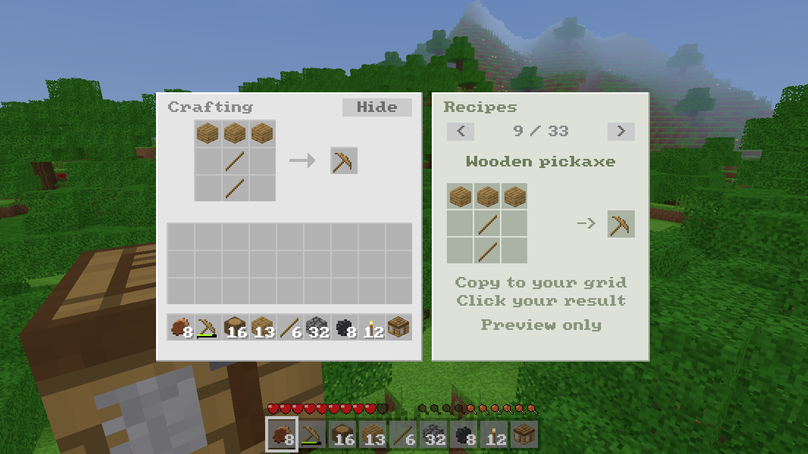<br>
      <h3>🔨 Craft your way up</h3>
      Tools and swords in five tiers, armor in four, bows, torches, beds and
      chests. A built-in recipe book shows you the layout, so no wiki needed.
    </td>
    <td width="50%" valign="top">
      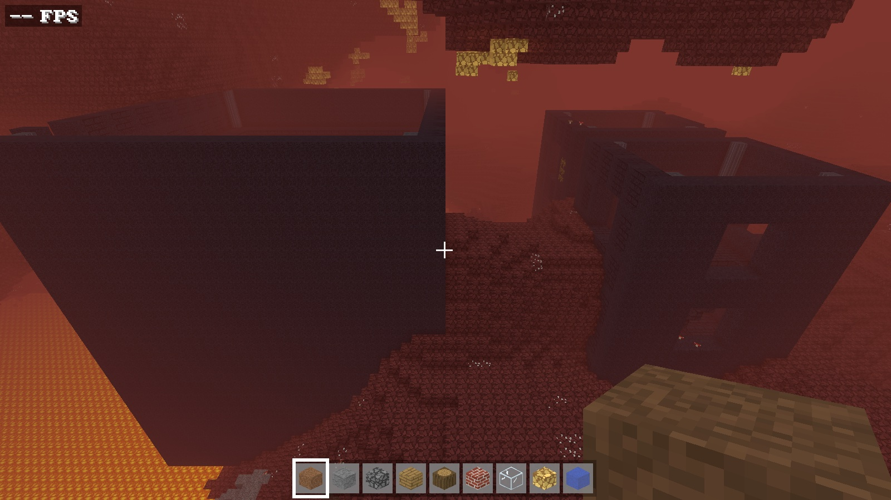<br>
      <h3>🔥 Three dimensions</h3>
      Light an obsidian portal to cross lava seas into fortresses and bastion
      remnants. Then follow your eyes of ender to the End and its dragon.
    </td>
  </tr>
  <tr>
    <td width="50%" valign="top">
      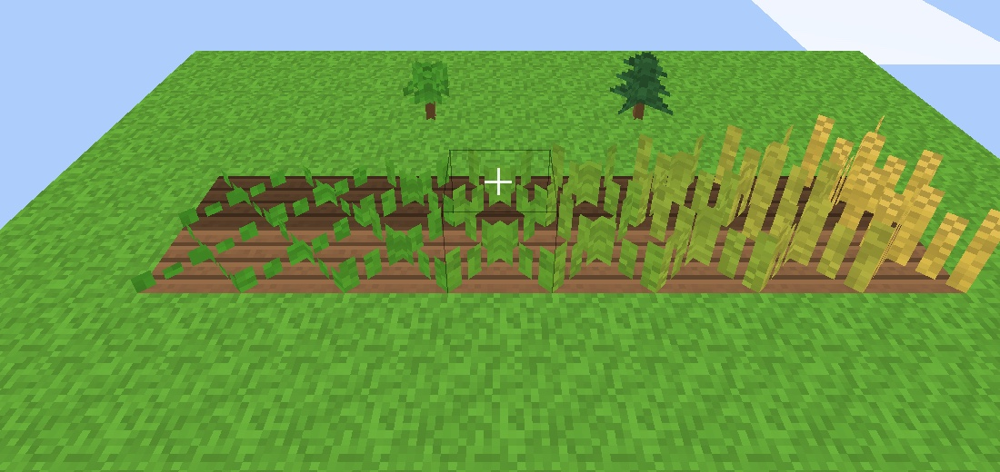<br>
      <h3>🌾 Settle down</h3>
      Till soil, sow seeds and bake bread. Saplings grow into trees, grass
      creeps back over bare dirt, and a bed skips the night.
    </td>
    <td width="50%" valign="top">
      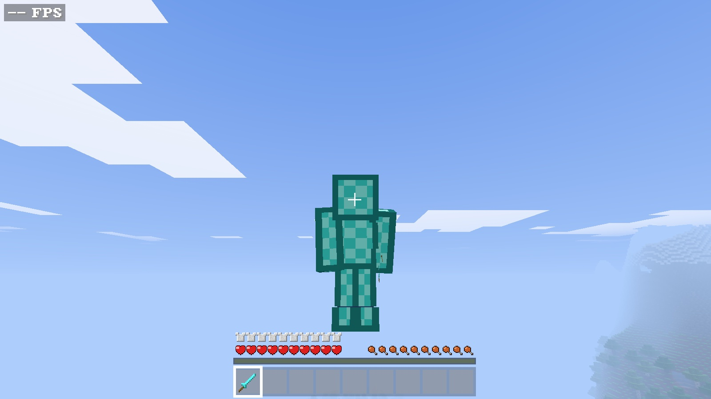<br>
      <h3>✨ Brew, enchant, upgrade</h3>
      Brew potions from nether wart, enchant gear, repair it at an anvil, and
      take diamond to Netherite at a smithing table. Press <kbd>F5</kbd> to
      admire the result.
    </td>
  </tr>
  <tr>
    <td width="50%" valign="top">
      <br>
      <h3>💧 A world that moves</h3>
      Water and lava flow, sand falls, fire spreads, TNT blows holes in the
      hills, and rain and snow roll in under drifting clouds.
    </td>
    <td width="50%" valign="top">
      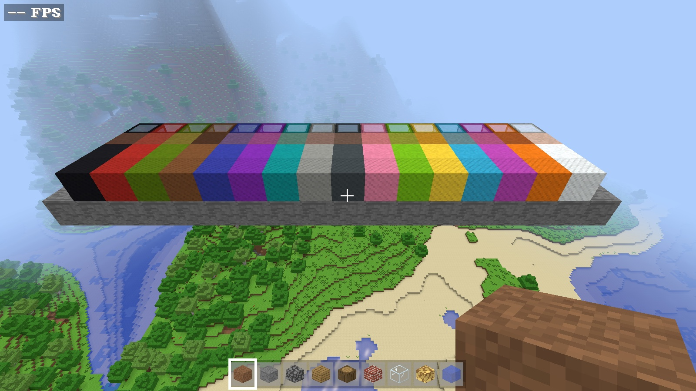<br>
      <h3>🎨 Build anything</h3>
      Sixteen dye colours across wool, glass, terracotta and concrete, every
      wood type, plus stairs, slabs, fences, doors and ladders.
    </td>
  </tr>
</table>

<details>
<summary><strong>📸 More screenshots</strong></summary>
<br>
<table>
  <tr>
    <td width="50%">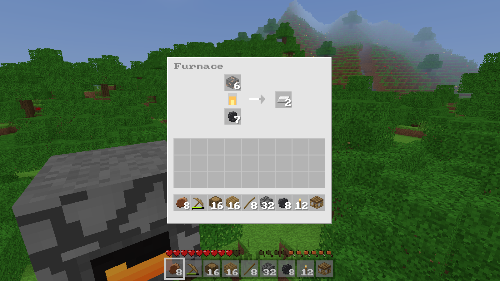<br><strong>Smelt and cook.</strong> Turn ore into ingots and raw food into meals.</td>
    <td width="50%">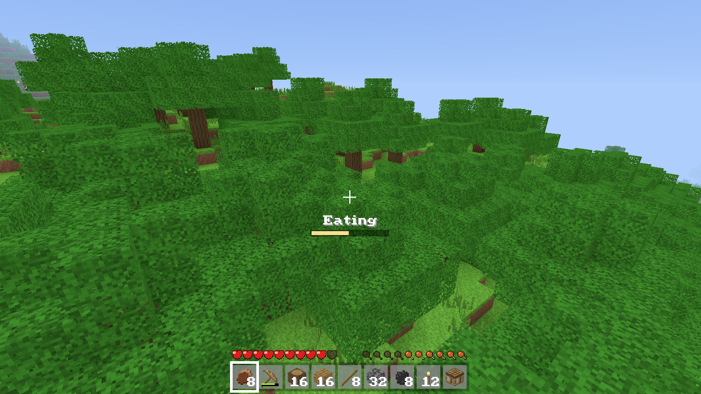<br><strong>A bite to eat.</strong> Hold right-click with food and watch the bite progress.</td>
  </tr>
  <tr>
    <td width="50%">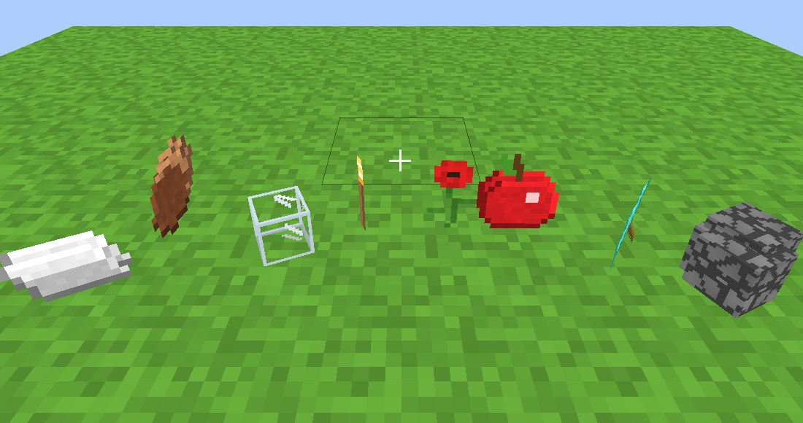<br><strong>Pick it up.</strong> Blocks and loot drop as spinning items.</td>
    <td width="50%">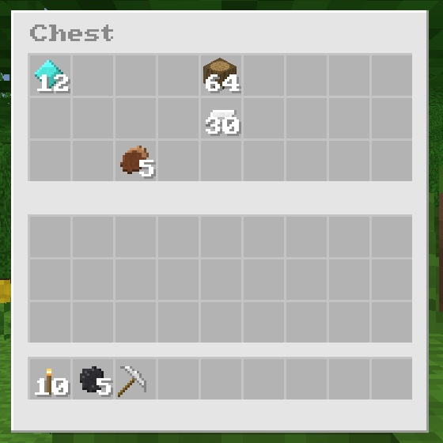<br><strong>Stash it.</strong> Chests hold 27 stacks; shift-click moves whole stacks.</td>
  </tr>
  <tr>
    <td width="50%"><br><strong>Go creative.</strong> Every block at your fingertips, and flight.</td>
    <td width="50%">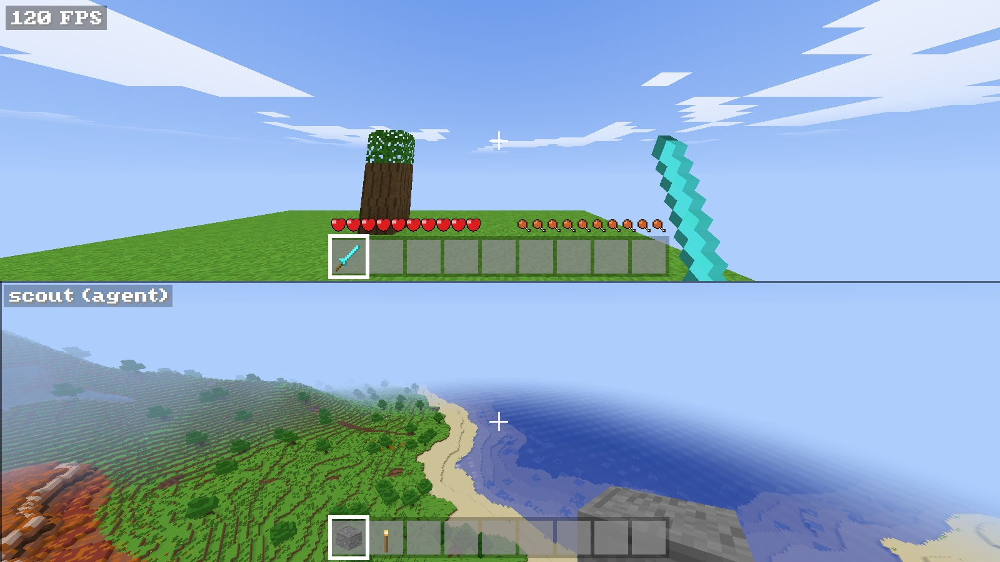<br><strong>Miles apart.</strong> Each split-screen view streams its own world at full distance.</td>
  </tr>
</table>
</details>

### Pick your challenge

| Mode | What it's like |
| --- | --- |
| 🛠️ **Creative** | Unlimited blocks, flight, no danger. Just build. |
| ⚔️ **Survival** | Health, hunger, timed mining, experience and loot. Choose your difficulty. |
| 💀 **Hardcore** | Survival on hard, with one life. Die and you're a spectator for good. |
| 🧭 **Adventure** / 👻 **Spectator** | Explore without breaking things, or float through walls and watch. |

## 🚀 Get started

### Download

Head to [**Releases**](https://github.com/BrendanH18/VoxelCraft/releases):

- **Windows:** run the setup wizard.
- **Mac:** open the Apple Silicon or Intel DMG and drag VoxelCraft into Applications.

> [!NOTE]
> These early builds aren't signed by a verified publisher yet, so your OS
> may warn you on first launch. The bundled installation notes walk you
> through it. Packaging details live in the [release guide](docs/releases.md).

### Build from source

You'll need a recent stable **Rust** toolchain (edition 2024; developed on
Rust 1.98) and a GPU that wgpu supports through Metal, Vulkan or DirectX 12.
CI builds on macOS, Linux and Windows.

```sh
# Debian/Ubuntu only: audio and gamepad headers
sudo apt-get install libasound2-dev libudev-dev pkg-config

git clone https://github.com/BrendanH18/VoxelCraft.git
cd VoxelCraft
cargo run --release
```

You'll land on the title screen with your saved worlds, most recent first.
Hit **Create New World**, give it a name, pick a mode and (optionally) a seed.
Worlds live under `saves/` in your
[per-user data folder](docs/releases.md#player-data-and-old-saves), autosave
every two minutes, and only store the chunks you've changed. Everything else
regrows from the seed.

Want to skip the menu? Name a world on the command line:

```sh
cargo run --release -- --creative --world sandbox --seed 42
```

<details>
<summary><strong>⚙️ Common command-line options</strong></summary>
<br>

| Option | What it does |
| --- | --- |
| `--creative` / `--survival` | Choose a game mode |
| `--world <name>` | Load or create `saves/<name>` directly, skipping the title screen |
| `--new` | Start the selected world fresh, replacing it when it saves |
| `--data-dir <dir>` | Use an isolated folder for saves, options and logs |
| `--seed <n>` | Set the seed for a new world |
| `--rd <chunks>` | View distance in 32-block chunks (default `8` = 256 blocks) |
| `--no-vsync` | Uncap the frame rate |
| `--graphics classic/enhanced` | Original look, or directional sunlight and reflective animated water |
| `--mute` / `--volume <0..1>` | Set audio at startup |
| `--agent-listen <IP:PORT>` | Host command-line players in this world ([details](docs/agents.md)) |
| `--split-screen <names>` | Show up to three hosted players in split-screen |
| `--help` | List every option, including benchmarks, screenshots and debug flags |

</details>

<a id="first-night"></a>

## 🌅 Your first night

Click the window to grab the mouse, then: <kbd>W</kbd><kbd>A</kbd><kbd>S</kbd><kbd>D</kbd>
to move, mouse to look, <kbd>Space</kbd> to jump, **left click** to mine or
fight, **right click** to place or open things, and <kbd>E</kbd> for your inventory.

The sun is already moving. Here's how to be ready when it sets:

1. 🌳 **Punch a tree.** Grab a few logs, open your inventory, and turn each
   log into four planks in the 2×2 crafting grid.
2. 🪵 **Make a crafting table** from four planks in a square, and some
   sticks from two planks stacked on top of each other.
3. ⛏️ **Craft a wooden pickaxe** on the table: three planks across the top,
   two sticks down the middle.
4. 🪨 **Mine some stone.** Eight cobblestone in a ring makes a furnace, and
   a stone pickaxe unlocks iron. Gold and diamond need iron or better.
5. 🍖 **Cook dinner.** Ore or raw meat goes on top of the furnace, fuel
   (coal, charcoal, wood or sticks) below. Hold right-click with food to eat.

Stuck on a recipe? Click **Recipes** in any crafting screen to flip through
layouts and copy them into your grid.

> [!WARNING]
> Dying drops everything you were carrying, and dropped items vanish after
> five minutes. Run back for your stuff!

<details>
<summary><strong>🎮 Full controls</strong></summary>
<br>

| Input | Action |
| --- | --- |
| <kbd>W</kbd> <kbd>A</kbd> <kbd>S</kbd> <kbd>D</kbd> / mouse | Move / look |
| <kbd>Space</kbd> | Jump (double-tap to fly in creative) |
| Left / right click | Mine or attack / place, use or eat |
| Middle click | Pick block |
| <kbd>E</kbd> | Inventory and 2×2 crafting |
| <kbd>1</kbd>–<kbd>9</kbd> or scroll | Select hotbar slot |
| <kbd>Q</kbd> / <kbd>Ctrl</kbd>+<kbd>Q</kbd> | Drop one item / the whole stack |
| <kbd>Shift</kbd> + click | Move a stack, or craft as many as fit |
| Left <kbd>Ctrl</kbd> or <kbd>R</kbd> | Sprint (needs more than three drumsticks of food) |
| Left <kbd>Shift</kbd> | Sneak, so you won't walk off edges (fly down in creative) |
| <kbd>F</kbd> | Toggle flight in creative |
| <kbd>G</kbd> | Switch game mode |
| <kbd>F5</kbd> | First person / third person back / third person front |
| <kbd>[</kbd> / <kbd>]</kbd> | Decrease / increase view distance |
| <kbd>/</kbd>, <kbd>T</kbd> or <kbd>`</kbd> | Command console with <kbd>Tab</kbd> completion: `/give`, `/tp`, `/time`, `/weather`, `/gamemode`, `/locate` and more |
| <kbd>F1</kbd> / <kbd>F3</kbd> | Hide HUD / debug overlay |
| <kbd>F11</kbd> | Fullscreen |
| <kbd>Esc</kbd> | Pause, options, and **Save and Quit to Title** |

Swim by sprinting in water; you'll crawl automatically through one-block gaps.
The [gameplay guide](docs/gameplay.md) covers survival rules, mobs and every recipe.

</details>

<a id="multiplayer"></a>

## 👥 Play together

<table>
  <tr>
    <td width="55%">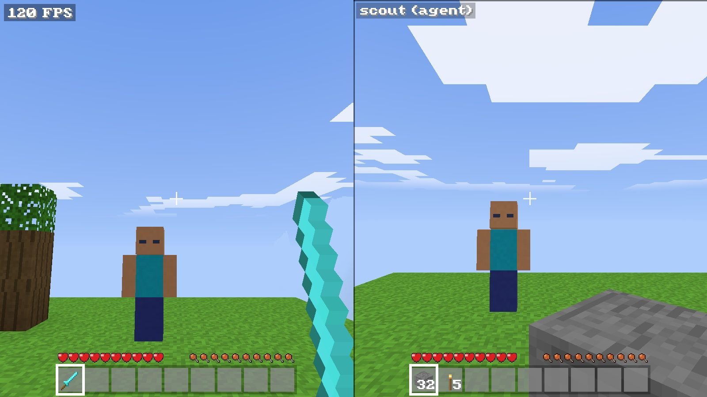</td>
    <td width="45%" valign="top">
      <h3>🎮 Couch co-op</h3>
      Plug in a gamepad and press <strong>Start</strong>. A friend pops in
      beside you with their own split-screen view, hotbar, health and hunger.
      Up to three controllers can join the keyboard player.
      <h3>🤖 Scripts and AI agents</h3>
      Host a world with <code>--agent-listen 127.0.0.1:4242</code> and up to
      eight command-line players can move, mine, build, craft and fight
      through the <code>voxelcraft-agent</code> tool. Mobs treat them just
      like you. Type <code>/splitscreen &lt;name&gt;</code> to watch one.
    </td>
  </tr>
</table>

See [hosted agents and commands](docs/agents.md) for the protocol, LAN setup
and current limits. Joining from a second game window is in progress.

<a id="under-the-hood"></a>

## 🔧 Under the hood

VoxelCraft is built to be fast. Chunks generate and light up in parallel on a
worker pool, greedy meshing merges faces into 12-byte quads that the vertex
shader unpacks, and everything shares a pooled GPU mesh arena. Smooth
lighting, ambient occlusion, reflective water, positional audio and a
procedural soundtrack all come from code.

On an **Apple M5**, release build, 1600 × 900, GPU synchronized every frame:

| View distance | Frame time | Frame rate |
| :-- | --: | --: |
| 256 blocks (`--rd 8`) | 1.17 ms | **~855 fps** |
| 512 blocks (`--rd 16`) | 2.40 ms | **~417 fps** |

Your numbers will vary with hardware and scene. The
[architecture notes](docs/architecture.md) dig into the renderer, code layout
and sound synthesis, and the [development guide](docs/development.md) shows
how to run benchmarks, script scenes and capture screenshots.

## 📚 Docs

| Playing | Building |
| --- | --- |
| [Gameplay guide](docs/gameplay.md): controls, survival, mobs, recipes | [Architecture](docs/architecture.md) |
| [Survival items](docs/survival-items.md): shears, compass, crops, fishing | [Development guide](docs/development.md) |
| [Bastions and Nether materials](docs/bastions.md), [Nether biomes](docs/nether-biomes.md) | [Release guide](docs/releases.md) |
| [Colours and dyes](docs/colors.md) | [Hosted agents and commands](docs/agents.md) |
| [Mob parity](docs/mob-parity.md) | [Performance investigation](docs/performance-2026-10-07.md) |
| [Player rendering](docs/player-rendering.md) | [Music](docs/music.md) and [particles](docs/particles.md) |
| [Nether mobs](docs/nether-mobs.md): piglins, bartering, hoglins, striders | |

## 🤝 Contributing

Found a bug, have an idea, or want to add a block? You're very welcome here.
[CONTRIBUTING.md](CONTRIBUTING.md) covers setup, the checks to run, and what
to include in a bug report.

## License

Licensed under [MIT](LICENSE-MIT) or [Apache 2.0](LICENSE-APACHE), at your option.

Unless you explicitly state otherwise, any contribution intentionally
submitted for inclusion in the work by you, as defined in the Apache-2.0
license, shall be dual licensed as above, without any additional terms or
conditions.

<sub>VoxelCraft is an independent project, not affiliated with or endorsed by
Mojang Studios or Microsoft. Minecraft is a trademark of Mojang Studios.
VoxelCraft contains no Minecraft code or assets.</sub>
