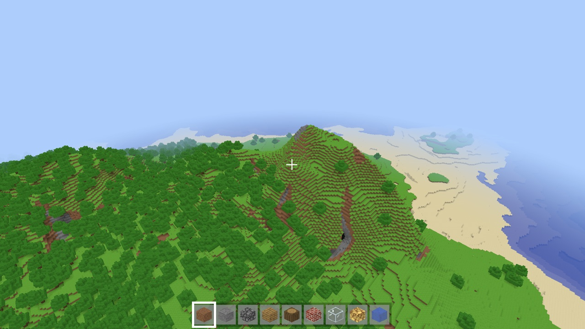
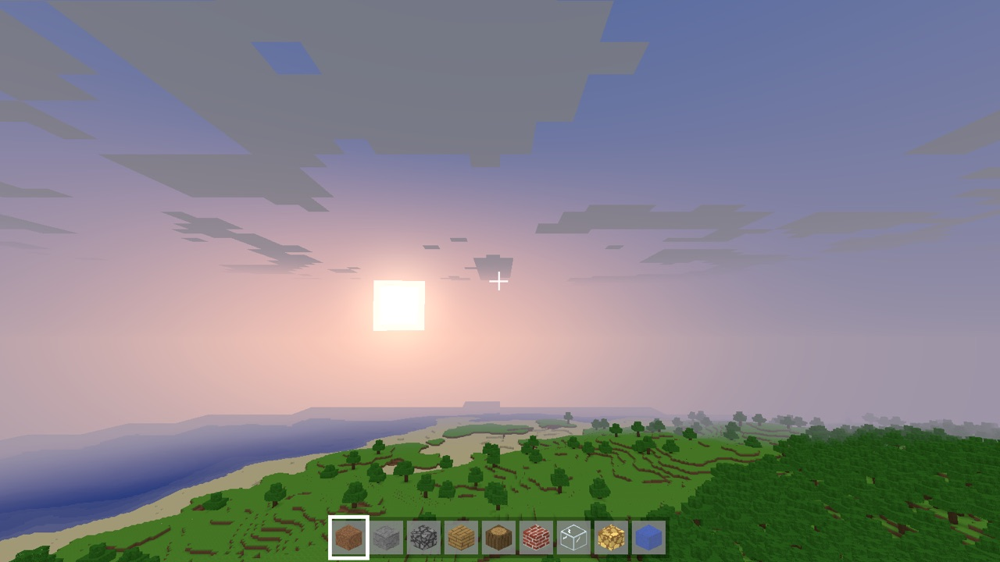
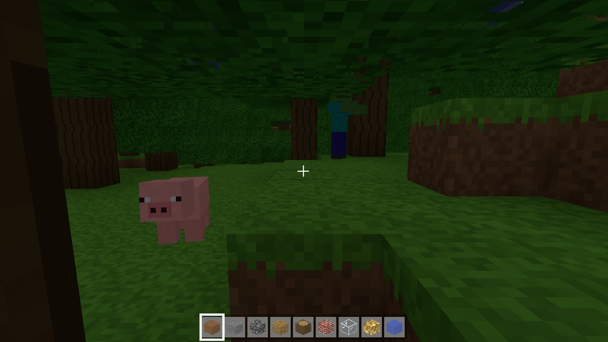
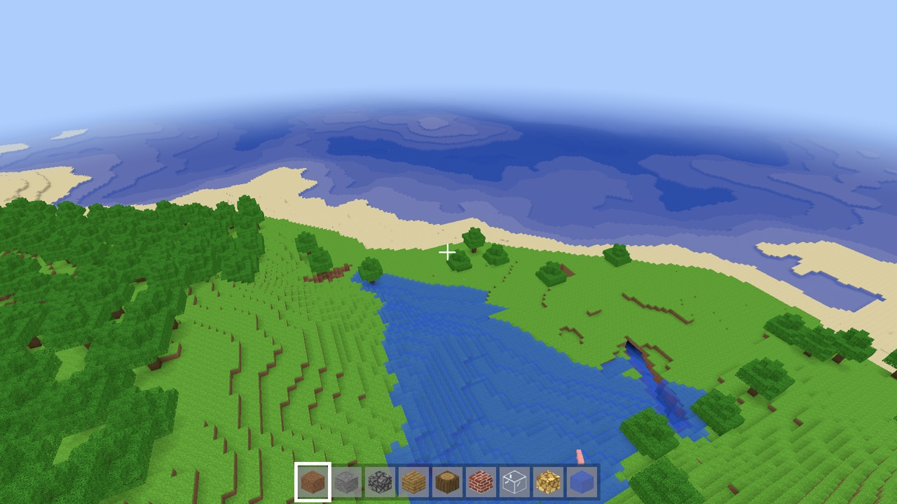
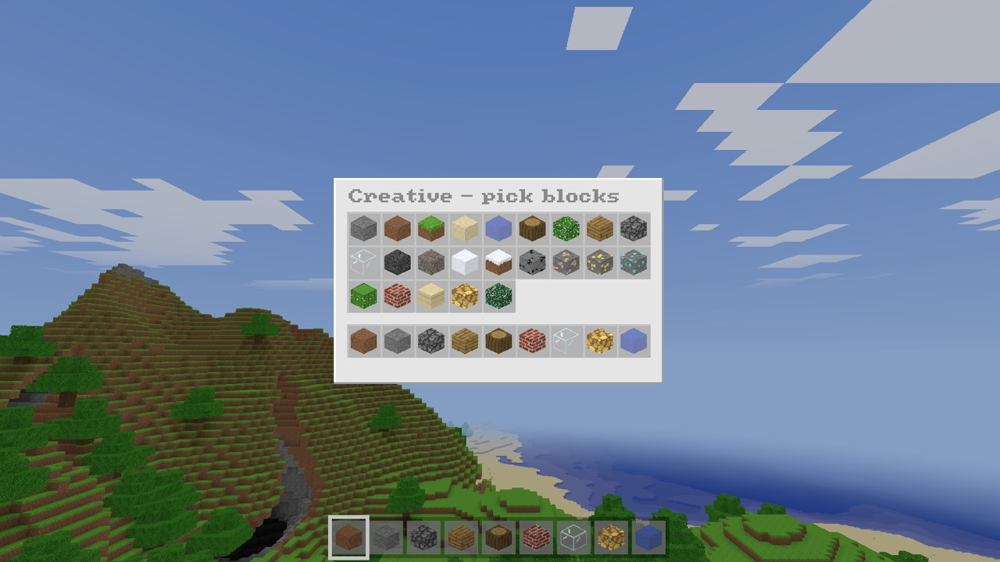

<div align="center">

<h1>VoxelCraft</h1>

<p><strong>A voxel world, built from scratch in Rust.</strong><br>
Explore, build, and survive in a procedurally generated sandbox powered by wgpu.</p>

<p>
  <a href="https://github.com/BrendanH18/minecraft_rust/actions/workflows/ci.yml"></a>
  <a href="Cargo.toml"></a>
  <a href="https://wgpu.rs"></a>
  <a href="#license"></a>
</p>

<p>
  <a href="#play"><strong>Play</strong></a> ·
  <a href="#screenshots">Screenshots</a> ·
  <a href="docs/gameplay.md">Gameplay guide</a> ·
  <a href="docs/architecture.md">Inside the engine</a> ·
  <a href="CONTRIBUTING.md">Contribute</a>
</p>



<p><em>Procedural terrain. Procedural textures. Procedural sound. No bundled game assets.</em></p>

</div>

## Explore, build, survive

- **A world to explore.** Infinite terrain with forests, deserts, snowy biomes,
  mountains, oceans, caves, ores, and trees.
- **Two ways to play.** Build freely in creative, or play survival with timed
  mining, block drops, a stackable inventory, health, and respawning.
- **A world that moves.** Flowing water and lava, falling sand, a day/night
  cycle, drifting clouds, herds of animals, and zombies, skeletons, creepers
  and spiders that come out at night.
- **Light and sound from code.** Smooth sky and block lighting, ambient
  occlusion, material-specific footsteps, positional audio, and underwater effects.
- **Built for speed.** Parallel chunk generation, greedy meshing, compact GPU
  quad records, and a shared mesh arena keep the world streaming around you.

VoxelCraft is an early sandbox project. Survival currently has health and air,
with inventory kept on death; hunger and crafting are not implemented.

## Play

Build from source with a **recent stable Rust toolchain** (edition 2024;
developed with Rust 1.98) and a GPU supported by wgpu's Metal, Vulkan, or
DirectX 12 backends. CI checks builds on macOS, Linux, and Windows.

On Debian/Ubuntu, install the audio and device headers before building:

```sh
sudo apt-get install libasound2-dev libudev-dev pkg-config
```

```sh
git clone https://github.com/BrendanH18/minecraft_rust.git
cd minecraft_rust
cargo run --release
```

This starts survival and resumes `./saves/world` when a save exists. To try
creative with a fixed seed in a separate world:

```sh
cargo run --release -- --creative --world creative --seed 42
```

| Option | What it does |
| --- | --- |
| `--creative` / `--survival` | Choose a game mode |
| `--world <name>` | Choose a save under `./saves/<name>` |
| `--seed <n>` | Set the seed for a new world |
| `--rd <chunks>` | Set view distance in 32-block chunks; default `8` = 256 blocks |
| `--no-vsync` | Uncap the frame rate |
| `--mute` / `--volume <0..1>` | Set audio at startup |
| `--help` | Show all options, including benchmarks and screenshots |

Worlds autosave every two minutes and on exit. Only modified chunks are stored;
the rest regenerates from the seed. `--new` starts fresh in the selected save
and replaces it when saving, so choose a new `--world` name to keep an old world.

### First steps

Click the window to capture the mouse. Move with **W A S D**, look with the
mouse, and press **Space** to jump. **Left click** breaks blocks or attacks mobs;
**right click** places blocks. Press **E** for inventory and **G** to switch modes.

| Input | Action |
| --- | --- |
| Left Ctrl or R | Sprint |
| 1–9 or scroll wheel | Select hotbar slot |
| Middle click | Pick block |
| F or double-tap Space | Toggle flight in creative |
| Space / Left Shift | Fly up / down |
| `[` / `]` | Decrease / increase view distance |
| F3 / F11 | Debug overlay / fullscreen |
| Esc | Pause menu: back to game, options (render distance, FOV, sensitivity, volume, vsync), save and quit |

See the [gameplay guide](docs/gameplay.md) for all controls, survival rules, and mob behavior.

## Screenshots

<table>
  <tr>
    <td width="50%"><br><strong>Day turns to night</strong><br>A procedural sky with sun, moon, stars, and clouds.</td>
    <td width="50%"><br><strong>Company after dark</strong><br>Animated mobs with wandering and combat behavior.</td>
  </tr>
  <tr>
    <td width="50%"><br><strong>Water finds its way</strong><br>Flowing sources, waterfalls, and underwater fog.</td>
    <td width="50%"><br><strong>Build something</strong><br>A creative block palette and nine-slot hotbar.</td>
  </tr>
</table>

## Inside the engine

The renderer uses greedy meshing, 12-byte quad records expanded in the vertex
shader, and pooled GPU buffers. Generation and lighting run on a worker pool;
frustum and face-direction culling reduce the work sent to the GPU.

Recorded development benchmarks on an **Apple M5**, in a **release build** at
**1600 × 900**, with the GPU synchronized after each frame:

| View distance | Average frame time | Approx. frame rate |
| --- | --- | --- |
| 256 blocks (`--rd 8`) | 1.10 ms | 900 fps |
| 512 blocks (`--rd 16`) | 2.05 ms | 490 fps |

These measurements include CPU and GPU work and vary with hardware and scene.
Read the [architecture notes](docs/architecture.md) for the full results,
rendering design, code layout, and sound synthesis. The
[development guide](docs/development.md) shows how to run benchmarks, script
scenes, capture screenshots, and export sounds.

## Contributing

Bug reports, ideas, and pull requests are welcome. Start with
[CONTRIBUTING.md](CONTRIBUTING.md) for setup, checks, and useful details to
include in a report.

## License

Licensed under [MIT](LICENSE-MIT) or [Apache 2.0](LICENSE-APACHE), at your option.

Unless you explicitly state otherwise, any contribution intentionally
submitted for inclusion in the work by you, as defined in the Apache-2.0
license, shall be dual licensed as above, without any additional terms or
conditions.

VoxelCraft is an independent project, not affiliated with or endorsed by
Mojang Studios or Microsoft. Minecraft is a trademark of Mojang Studios.
It contains no Minecraft code or assets.
