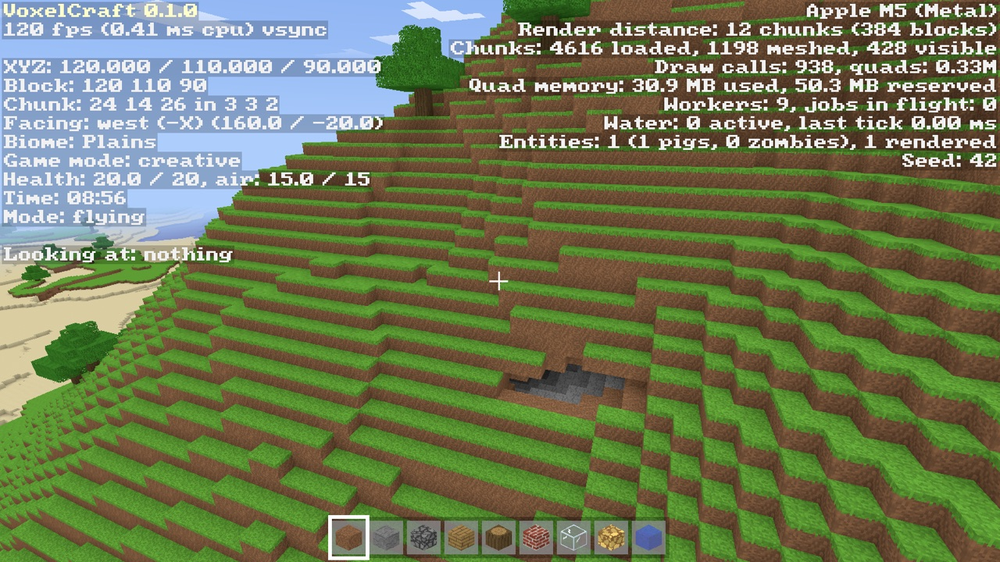

# Gameplay guide

[← Back to VoxelCraft](../README.md) · [Development tools](development.md)

## Controls

| Input | Action |
|---|---|
| Mouse | Look (click the window to capture the mouse) |
| W A S D | Move |
| Space | Jump / swim up / fly up — double-tap to toggle flying (creative) |
| Left Shift | Fly down |
| Left Ctrl or R | Sprint |
| F | Toggle flying (creative) |
| Left / right click | Break / place block (hold to repeat); left click on a mob attacks it; respawn on the death screen |
| Middle click | Pick block |
| Q / Ctrl+Q | Drop one of the selected item / the whole stack (with the inventory open: from the slot under the mouse) |
| E | Inventory (click to move stacks; creative shows the block palette) |
| Shift + click | In the inventory: move a stack between the open chest or furnace and the inventory (or between hotbar and main grid); on a crafting result, craft as many as fit |
| Shift + right click | Build against a crafting table, furnace or chest instead of opening it |
| Hold / release right click with a bow | Draw / shoot an arrow (needs arrows in survival) |
| Right click with flint and steel | Light an obsidian portal frame or a TNT block |
| Right click with a bucket | Scoop up a water or lava source / pour it out again |
| Right click with a hoe | Till grass or dirt (with air above) into farmland |
| Right click with seeds / bone meal | Sow wheat on farmland / make a crop, sapling or patch of grass grow |
| G | Toggle survival / creative |
| 1–9, scroll wheel | Select hotbar slot |
| `[` / `]` | Decrease / increase render distance |
| T | Skip ahead 2 in-game hours |
| M | Mute / unmute sound (`--mute` starts muted, `--volume 0..1` sets the master volume) |
| V | Toggle vsync |
| F1 | Toggle HUD |
| F3 | Debug screen |
| F11 | Fullscreen |
| Esc | Pause menu (the game pauses): Back to Game, Options..., Save and Quit to Title; Esc again goes back |

The world autosaves every two minutes and on exit. Switching away from
the window also pauses the game.

**Options** (Esc → Options...): render distance (2–32 chunks), field of
view (30–110°), mouse sensitivity (25–300%), master volume and vsync.
Changes apply immediately and are saved to `saves/options.txt` inside the
[per-user data folder](releases.md#player-data-and-old-saves) when you
leave the screen; `[`/`]` and V adjust render distance and vsync in game.
`--rd`, `--volume` and `--no-vsync` override the saved options for one
session.

## World and survival features

- Infinite procedurally generated terrain in fourteen biomes: oceans,
  beaches, winding rivers, plains, oak and birch forests, swamps with
  shallow pools, deserts, terraced badlands striped with terracotta,
  savannas, jungles, snowy tundra, taiga and mountains. Cold seas and rivers
  freeze over (ice is slippery underfoot, and broken ice turns back into water). Grass and oak leaves take
  on the colour of their biome: murky in swamps, dry and yellow in savannas
  and badlands, vivid in jungles and cool in the snow, blending across
  biome borders. Clay (4 clay balls when
  broken) lines river and swamp beds. Spaghetti caves, deep caverns and ores lie below. Five kinds
  of tree grow there: oak, birch, spruce, acacia (leaning trunks under flat
  canopies) and jungle (tall trees, giant 2x2 trees and bushes), plus cacti
- Farming and growth, driven by Minecraft-style random block ticks in the
  chunks within 128 blocks (each block is picked about once a minute).
  Breaking tall grass sometimes drops wheat seeds; till grass or dirt with
  a hoe and sow them on the farmland. Farmland with water within 4 blocks
  turns dark and wet; wheat grows through 8 stages under open sky, about
  twice as fast on wet farmland, and ripe wheat drops wheat and 1-4 seeds
  (unripe wheat just its seed). Bare dry farmland turns back to dirt, and
  jumping or falling onto farmland can trample it. Leaves drop their tree's
  sapling (1 in 20, jungle 1 in 40; oak leaves also apples, 1 in 200);
  planted on grass or dirt, saplings grow into trees.
  Sugar cane grows next to water up to 3 blocks tall, and must be planted
  on grass, dirt or sand beside water. Leaves that can't reach a log
  within 6 blocks decay a few seconds after a tree is felled. Grass spreads
  to lit dirt nearby and dies under blocks. Bone meal advances a crop 2-5
  stages, sometimes grows a sapling at once, and sprouts grass and flowers
  around a grass block. Crops and saplings only grow in sunlight (torches
  don't count yet)
- Tall grass, ferns, dandelions, poppies and blue orchids (flowers grow in
  patches), dead bushes in deserts and badlands, sugar cane along the
  water, pumpkins on the plains and melons in jungles. Plants and torches are
  drawn as two crossed planes, break instantly, need soil (torches a full
  block) beneath them and pop off when it goes, and are washed away by
  water. Clicking tall grass with a block replaces it
- Weather, like Minecraft: clear spells of one to five days alternate with
  rain lasting half a day to a day and a half. Rain falls as snow in cold
  biomes and above y = 150, and not at all in deserts, savannas and
  badlands. It greys and darkens the sky, hides the sun, moon and stars
  behind thicker clouds, stops at the first block overhead, waters
  farmland under open sky, keeps zombies and skeletons from burning, and
  can be heard drumming on the roof. The time of day and the weather are
  saved with the world
- Torches give off light level 14 (glowstone 15)
- Flood-fill sky and block light with smooth lighting and ambient occlusion
- Day/night cycle with a procedural sky: square sun and moon, sunset glow,
  rotating stars and drifting blocky clouds; distance and underwater fog
- Flowing water: falls, spreads up to 7 blocks toward the nearest drop,
  dries up without a source, and forms infinite sources; lowered surfaces
- Lava: flows like water but six times slower and only 3 blocks, glows
  (light 15), fills caves below y = 10, burns players (4 damage every
  0.5 s) and mobs, and can be swum through with an orange haze. Where lava
  meets water a source hardens into obsidian, flowing lava into
  cobblestone, and lava pouring onto water turns it to stone
- Sand and gravel fall when unsupported, as free-moving blocks that land
  on the first solid block (replacing plants and fluids in the way);
  knocking out a column's base drops the whole column
- Walking, swimming and flying with AABB collision
- Nine mobs with Minecraft-style animated box models (see [Mobs](#mobs)):
  pigs, cows, sheep and chickens wander in herds and panic when hit;
  zombies, skeletons, creepers and spiders hunt at night. Skeletons shoot
  arcing arrows that stick in blocks, creepers hiss, swell and explode
  (blowing a crater in the world), spiders climb walls. Mobs avoid tall
  drops, float in water, flash red when hurt and topple over when killed;
  killing one drops its loot. All mobs,
  arrows and explosion smoke are drawn in a single draw call
- Survival and creative modes: timed block breaking with crack overlay,
  drops, a 36-slot inventory with stacks, and a scrollable creative palette
- Crafting: a 2x2 grid in the survival inventory and a 3x3 grid at a
  crafting table (right-click it). Shaped recipes work anywhere in the
  grid and mirrored; click the result to craft one, and leftovers return
  to the inventory when the screen closes (thrown out if it's full). Click Recipes
  to browse layouts with the arrow buttons or scroll wheel; hover ingredients
  for names and alternatives, then copy the preview into your crafting grid.
  On narrower windows, Back closes the recipe overlay so you can craft.
  Recipes: planks (each log makes its own kind; any planks work in
  recipes), sticks, crafting table, chest (8 planks in a ring), torches
  (coal or charcoal over a stick), bread (3 wheat in a row), bone meal (from
  a bone), sandstone, wool (from string), clay and bricks (4 clay balls or
  bricks), melon slices (from a melon), bows (3 sticks and 3 string),
  arrows (flint, stick and feather; gravel drops flint 1 time in 10), and pickaxes, shovels, axes,
  hoes and swords in wood, stone, iron, gold and diamond
- Tools follow Minecraft's mining rules: a block takes its hardness x 1.5
  seconds to mine with something that can harvest it and x 5 otherwise,
  divided by the tool's speed when it's the right kind (pickaxe for stone
  and ores, shovel for dirt, sand and gravel, axe for wood). Stone and ores
  only drop with a pickaxe of a high enough tier: wood or gold for stone
  and coal, stone for iron, iron for gold and diamond, diamond for
  obsidian. Stone by hand takes 7.5 s; with a wooden pickaxe 1.1 s, down
  to 0.19 s with gold. Tools lose 1 durability per block (swords 2) and 1
  per hit (other tools 2), and break when worn out. Melee damage comes from
  the held item: a fist 1, swords 4 (wood, gold) to 7 (diamond), axes,
  pickaxes and shovels less
- Slabs: three stone, cobblestone, planks, sandstone, bricks or nether
  bricks in a row make six half-height slabs that mine like their full
  block. Placing a slab on top of the same slab makes the full block
- TNT (5 gunpowder and 4 sand in a checkerboard): light it with flint and
  steel and it hops out of its block, flashing white and swelling for 4
  seconds before a blast stronger than a creeper's (power 4). TNT caught in
  a blast goes off within a second and a half, so stacks chain. Explosions
  hurt through armor, knock you back and drop some of what they destroy
- Buckets (3 iron ingots in a V, stack to 16): right-click a water or lava
  source to fill one and right-click a block to pour it out next to it.
  Creative keeps its empty bucket. A lava bucket smelts for 1000 s and
  leaves the empty bucket behind in the furnace
- Bows: hold right-click to draw (fully drawn after 1 s; the bar under the
  crosshair turns gold and the view zooms in a little) and release to
  shoot. A full draw deals 6 damage plus a random critical bonus of up to
  4; weaker draws fly slower and hit softer. Arrows arc, knock mobs back,
  stick in blocks and drop out when the block is broken. Walk over a stuck
  arrow to pick it back up (arrows shot in creative can't be collected).
  Bows have 384 uses
- Furnaces (8 cobblestone in a ring): right-click to open; put something
  to smelt on top and fuel below. Each item takes 10 s; coal and charcoal
  burn 80 s, logs, planks, crafting tables and chests 15 s, wooden tools 10 s and
  sticks 5 s. Smelts iron and gold ore into ingots, sand into glass,
  cobblestone into stone, logs into charcoal, clay balls into bricks, clay
  into terracotta and raw meat into cooked meat. A burning furnace glows (light 13), keeps smelting with its
  screen closed while its chunk is loaded, and is saved with the world;
  breaking one drops its contents
- Items beyond blocks, each with a procedurally drawn icon: sticks, coal,
  ingots, diamonds, food, mob materials, and pickaxes, shovels, axes, hoes
  and swords in five tiers with durability bars. Coal and diamond ore drop
  their items
- Survival health: 10 hearts, fall damage (1 per block beyond 3; water
  breaks falls), 15 s of air then drowning, a red hurt flash and shaking
  hearts. Dying shows
  a death screen; everything you carried drops where you died, and clicking
  respawns at the world spawn with full health. Creative is immune to damage.
  Health and air are saved with the world
- Hunger, like Minecraft: 10 drumsticks plus a hidden saturation buffer
  (5 at spawn). Exhaustion from sprinting (0.1 per block), swimming (0.01
  per block), jumping (0.05, 0.2 sprinting), mining (0.005), attacking
  (0.1) and taking damage (0.1) costs a point of saturation, then food,
  every 4. Health regenerates half a heart every 4 s from 18 food (costing
  6 exhaustion), or every 0.5 s with a full bar and saturation left; an
  empty bar starves you down to half a heart. You can't sprint at 6 food or
  less. Hold right-click with food for 1.6 s to eat (not when full); the
  Eating indicator below the crosshair shows the bite's progress. The hunger
  bar shows on the right above the hotbar, with air bubbles above it.
  Creative players don't get hungry. Hunger is saved with the world
- Break, place and pick blocks, with a selection outline and hotbar
- Chests (8 planks in a ring): right-click to open 27 slots of storage
  above your inventory. Their contents are saved with the world and drop
  when the chest is broken. Chests and furnaces face you when placed
- Dropped items, like Minecraft's: mined blocks, mob loot, furnace
  contents, plants that pop off or wash away, and a third of what an
  explosion destroys drop as small spinning blocks or item icons (extra
  copies for bigger stacks). They fall, slide, float up in water, burn in
  lava, merge with matching stacks nearby, and vanish after five minutes
  (the timer stops while their chunk is unloaded). Walk over them to pick
  them up (thrown items wait 2 s first). Q drops the selected item, Ctrl+Q
  the stack; clicking off the inventory window throws the held stack (right
  click: one item). Items that don't fit when a crafting screen closes are
  thrown out. Dropped items are saved with the world
- Procedurally generated, mipmapped block textures — the game ships no assets
- Procedural sound, synthesized in code at startup (~25 ms): material-specific
  break/place/footstep sounds (stone, wood, dirt, grass, gravel, sand, snow,
  leaves, glass, water), jump and landing thuds, splashes and swimming,
  creeper hisses and explosions, bow twangs,
  inventory clicks, wind and cave ambience with dripping water, positional
  panning and distance falloff, and a muffled mix while underwater

## The Nether

Build a frame of obsidian (pour a water bucket over lava source blocks,
then mine the obsidian with a diamond pickaxe) at least 4 wide and 5 tall around an
empty inside of 2x3 up to 21x21; the corners can be left out. Light it
with flint and steel (iron ingot and flint, shapeless; 64 uses) to fill it
with a swirling portal. Stand in it for 4 seconds (half a second in
creative) to travel to the Nether, and the same way back. Each block in
the Nether is eight in the overworld: the game looks for a portal within
16 blocks of the matching spot on the other side, and builds one (on an
obsidian ledge if there's nowhere to stand) if there isn't. Breaking any
part of a frame puts its portal out.

The Nether is a cavern world between a bedrock floor and roof: netherrack
cliffs and islands over a lava sea at y = 31, soul sand shores that drag
at your feet, gravel by the lava, quartz ore in the rock and glowstone
hanging from the ceilings. There is no sky, weather or day and night,
just a steady dim glow in a red haze; water boils away, and beds explode.
Netherrack smelts into nether bricks (four make a nether bricks block),
quartz ore drops nether quartz, and glowstone breaks into 2–4 glowstone
dust (four make a block). Nine gold nuggets make a gold ingot and back.

Each dimension keeps its own blocks, furnaces, chests and dropped items in
the save (the Nether in a `nether` folder inside the world's). Dying in
the Nether respawns you in the overworld. `--dimension nether` starts a
session there, as if you had just come through a portal.

## Mobs

| Mob | Health | Behaviour | Loot (player kills) |
|---|---|---|---|
| Pig | 10 | wanders, idles, looks around; panics when hit | 1–3 raw porkchop |
| Cow | 10 | like pigs | 1–3 raw beef, 0–2 leather |
| Sheep | 8 | like pigs | 1 wool |
| Chicken | 4 | like pigs; flutters down instead of falling | 1 raw chicken, 0–2 feathers |
| Zombie | 20 | chases within 24 blocks, hits for 3 every second; burns in sunlight | 0–2 rotten flesh |
| Skeleton | 20 | keeps 5–10 blocks away, strafes, and shoots arrows (about 3 damage) when it can see you; burns in sunlight | 0–2 bones, 0–2 arrows |
| Creeper | 20 | walks up and lights a 1.5 s fuse within 3 blocks (kept lit within 7); explodes for up to 43 damage over 6 blocks, destroying blocks (not bedrock, obsidian or fluids) | 0–2 gunpowder |
| Spider | 16 | fast; climbs walls; hunts only in the dark or after being hit, bites for 2 | 0–2 string |
| Zombified piglin | 20 | Nether only, in packs; ignores you until you hit one, then the whole pack within 32 blocks chases you for 30 s and strikes with gold swords for 5 | 0–1 rotten flesh, 0–1 gold nuggets |

Animals spawn on sky-exposed grass in herds (up to 4 of each kind);
hostile mobs spawn on sky-exposed solid ground when daylight < 0.35 (up to
4 zombies and 3 of the others). Mobs spawn 24–64 blocks from the player
and despawn beyond 96 blocks or when their chunk unloads. Every mob burns
in lava. Player hits deal damage based on the held item, with knockback, at most
every 0.5 s: a fist deals 1, and swords deal 4–7 depending on their tier.
Hostile mobs ignore creative players.
